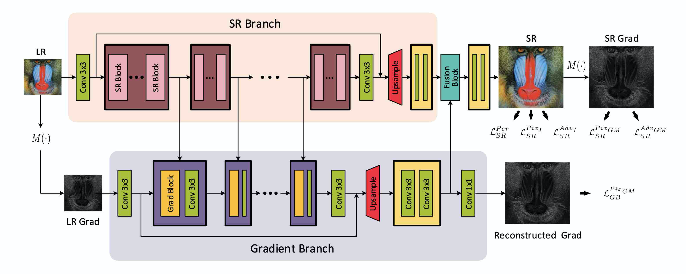
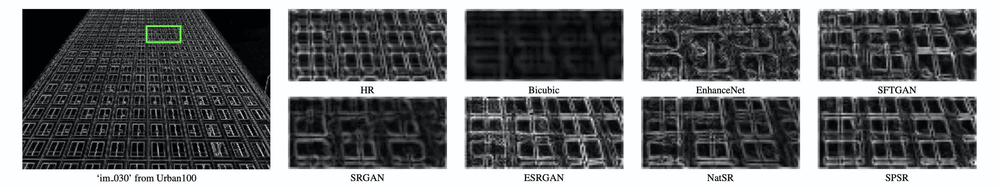

# SPSR

PyTorch implementation of Structure-Preserving Super Resolution with Gradient Guidance (CVPR 2020) \[[arXiv](https://arxiv.org/abs/2003.13081)\]
<p align="center">
  
</p>

If you find our work useful in your research, please consider citing:
```
@inproceedings{ma2020structure,
  title={Structure-Preserving Super Resolution with Gradient Guidance},
  author={Ma, Cheng and Rao, Yongming and Cheng, Yean and Chen, Ce and Lu, Jiwen and Zhou, Jie},
  booktitle={Proceedings of the IEEE Conference on Computer Vision and Pattern Recognition (CVPR)},
  year={2020}
}
```


## Dependencies

- Python 3 (Recommend to use [Anaconda](https://www.anaconda.com/download/#linux))
- [PyTorch >= 1.0](https://pytorch.org/)
- NVIDIA GPU + [CUDA](https://developer.nvidia.com/cuda-downloads)
- Python packages: `pip install numpy opencv-python lmdb pyyaml`
- TensorBoard: 
  - PyTorch >= 1.1: `pip install tb-nightly future`
  - PyTorch == 1.0: `pip install tensorboardX`


## Dataset Preparation

### Download Datasets

Commonly used training and testing datasets can be downloaded [here](https://github.com/xinntao/BasicSR/wiki/Prepare-datasets-in-LMDB-format).

### Preprocess Datasets

We also provide code to preprocess the datasets [here](https://github.com/Maclory/SPSR/tree/master/preprocess). 

- After downloading the original datasets, please store them to a specific GT folder. 

- You can obtain the **LR**, **HR** and **Bicubic-upsampled** versions of the datasets.  

- Then you can extract **sub-images** with unified scales for training. 

- The training sets can also be transformed into **LMDB** format for faster IO speed. 


## Training 

To train an SPSR model: 

`python train.py -opt options/train/train_spsr.json`

- The json file will be processed by `options/options.py`. Please refer to [this](https://github.com/Maclory/SPSR/tree/master/code/options/README.md) for more details.

- Before running this code, please modify `train_spsr.json` to your own configurations including: 
  - the proper `dataroot_HR` and `dataroot_LR` paths for the data loader ([More details](https://github.com/Maclory/SPSR/tree/master/code/data/README.md))
  - saving frequency for models and states
  - whether to resume training with `.state` files
  - other hyperparameters
  - loss function, etc. 

- You can find your training results in `./experiments`.

- During training, you can use Tesorboard to monitor the losses with
`tensorboard --logdir tb_logger/NAME_OF_YOUR_EXPERIMENT`

- You can choose to use a pretrained RRDB model as a parameter initialization by setting the `pretrain_model_G` option in `options/train/train_spsr.json`. Please download the pretrained model from [Google Drive](https://drive.google.com/drive/folders/1c4EbfI6X4KzCiyg1H7TA6rJY-HVgvS3q?usp=sharing) or [Baidu Drive](https://pan.baidu.com/s/1bcDiD07aTUO2THmEXZJaiA) (extraction code muw3) and place `RRDB_PSNR_x4.pth` into `./experiments/pretrain_models`. 


## Testing

To generate SR images by an SPSR model:

`python test.py -opt options/test/test_spsr.json`

- Similar to training, the configurations can be modified in the `test_spsr.json` file.

- You can find your results in `./results`.

- We provide **our SPSR model** used in our paper that can be downloaded in [Google Drive](https://drive.google.com/drive/folders/1c4EbfI6X4KzCiyg1H7TA6rJY-HVgvS3q?usp=sharing) or [Baidu Drive](https://pan.baidu.com/s/1bcDiD07aTUO2THmEXZJaiA) (extraction code muw3). Download `spsr.pth` and put it into `./experiments/pretrain_models`. Then modify the directory of pretrained model in `test_spsr.json` and run `test.py`. 

- You can put your own LR images in a certain folder and just change the `dataroot_LR` setting in `test_spsr.json` and run `test.py`. 

## Evaluation Toolbox

We provide a easy and useful [**evaluation toolbox**](https://github.com/Maclory/SPSR/tree/master/metrics) to simplify the procedure of evaluating SR results. In this toolbox, you can get the [MA](https://github.com/chaoma99/sr-metric), [NIQE](https://github.com/csjunxu/Bovik_NIQE_SPL2013), [PI](https://github.com/roimehrez/PIRM2018), PSNR, [SSIM](https://ece.uwaterloo.ca/~z70wang/research/ssim), MSE, RMSE, MAE and [LPIPS](https://github.com/richzhang/PerceptualSimilarity) values of any SR results you want to evaluate. 

## Results 
### Visual Results
<p align="center">
  
</p>
<p align="center">
  
</p>

### Quantitative Results

From the below two tables of comparison with perceptual-driven SR methods, we can see our SPSR method is able to obtain the **best [PI](https://github.com/roimehrez/PIRM2018) and [LPIPS](https://github.com/richzhang/PerceptualSimilarity)** performance and **comparable PSNR and [SSIM](https://ece.uwaterloo.ca/~z70wang/research/ssim)** values simultaneously. The top 2 scores are highlighted.

PI/LPIPS comparison with perceptual-driven SR methods.

| Method                                        | Set5                    | Set14                   | BSD100                  | General100              | Urban100                |
| --------------------------------------------- | ----------------------- | ----------------------- | ----------------------- | ----------------------- | ----------------------- |
| Bicubic                                       | 7\.3699/0\.3407         | 7\.0268/0\.4393         | 7\.0026/0\.5249         | 7\.9365/0\.3528         | 6\.9435/0\.4726         |
| [SFTGAN](https://github.com/xinntao/SFTGAN)   | 3\.7587/0\.0890         | **2\.9063**/0\.1481     | **2\.3774**/0\.1769     | **4\.2878**/0\.1030     | **3\.6136**/0\.1433     |
| [SRGAN](https://github.com/tensorlayer/srgan) | 3\.9820/0\.0882         | 3\.0851/0\.1663         | 2\.5459/0\.1980         | 4\.3757/0\.1055         | 3\.6980/0\.1551         |
| [ESRGAN](https://github.com/xinntao/ESRGAN)   | **3\.7522**/**0\.0748** | 2\.9261/**0\.1329**     | 2\.4793/**0\.1614**     | 4\.3234/**0\.0879**     | 3\.7704/**0\.1229**     |
| [NatSR](https://github.com/JWSoh/NatSR)       | 4\.1648/0\.0939         | 3\.1094/0\.1758         | 2\.7801/0\.2114         | 4\.6262/0\.1117         | 3\.6523/0\.1500         |
| SPSR                                          | **3\.2743**/**0\.0644** | **2\.9036**/**0\.1318** | **2\.3510**/**0\.1611** | **4\.0991**/**0\.0863** | **3\.5511**/**0\.1184** |

PSNR/SSIM comparison with perceptual-driven SR methods.

| Method                                        | Set5                    | Set14                   | BSD100                  | General100              | Urban100                |
| --------------------------------------------- | ----------------------- | ----------------------- | ----------------------- | ----------------------- | ----------------------- |
| Bicubic                                       | 28\.420/0\.8245         | 26\.100/0\.7850         | 25\.961/0\.6675         | 28\.018/0\.8282         | 23\.145/0\.9011         |
| [SFTGAN](https://github.com/xinntao/SFTGAN)   | 29\.932/0\.8665         | 26\.223/0\.7854         | 25\.505/0\.6549         | 29\.026/0\.8508         | 24\.013/0\.9364         |
| [SRGAN](https://github.com/tensorlayer/srgan) | 29\.168/0\.8613         | 26\.171/0\.7841         | 25\.459/0\.6485         | 28\.575/0\.8541         | 24\.397/0\.9381         |
| [ESRGAN](https://github.com/xinntao/ESRGAN)   | **30\.454**/**0\.8677** | 26\.276/0\.7783         | 25\.317/0\.6506         | 29\.412/**0\.8546**     | 24\.360/0\.9453         |
| [NatSR](https://github.com/JWSoh/NatSR)       | **30\.991**/**0\.8800** | **27\.514**/**0\.8140** | **26\.445**/**0\.6831** | **30\.346**/**0\.8721** | **25\.464**/**0\.9505** |
| SPSR                                          | 30\.400/0\.8627         | **26\.640**/**0\.7930** | **25\.505**/**0\.6576** | **29\.414**/0\.8537 | **24\.799**/**0\.9481** |

## Acknowledgement
The code is based on [BasicSR](https://github.com/xinntao/BasicSR), [MA](https://github.com/chaoma99/sr-metric), [NIQE](https://github.com/csjunxu/Bovik_NIQE_SPL2013), [PI](https://github.com/roimehrez/PIRM2018), [SSIM](https://ece.uwaterloo.ca/~z70wang/research/ssim) and [LPIPS](https://github.com/richzhang/PerceptualSimilarity). 

## Contact 
If you have any questions about our work, please contact <macheng17@mails.tsinghua.edu.cn>
